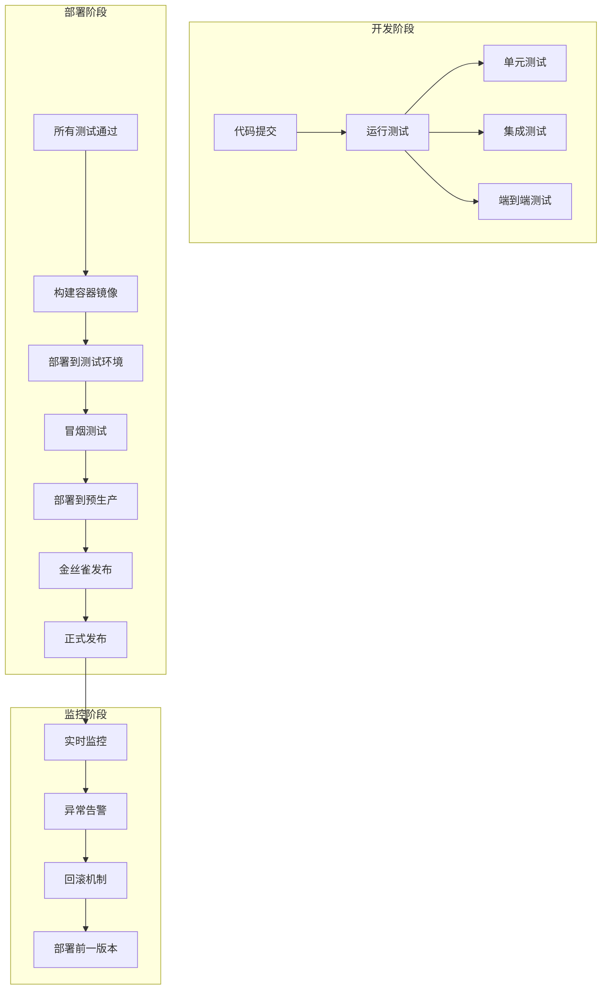
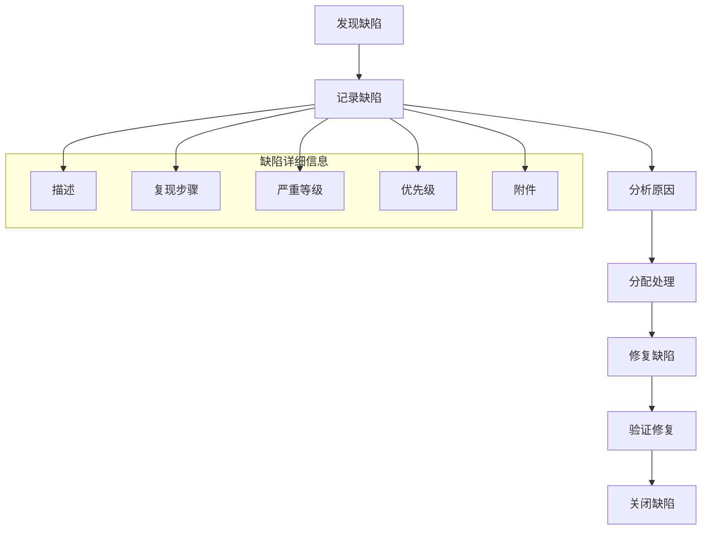

# Dora 魔盒集成测试方案

## 文档信息

| 项目 | 内容 |
|------|------|
| 文档名称 | 集成测试方案 |
| 版本 | v1.0 |
| 创建日期 | 2026-03-30 |
| 状态 | 初稿 |

## 一、概述

### 1.1 测试目标

- 验证各服务间通信的正确性
- 验证系统各模块集成后的功能正常
- 验证数据在服务间的传输和转换
- 发现单元测试无法发现的集成问题
- 确保系统的整体功能符合需求

### 1.2 测试范围

| 集成类型 | 测试内容 |
|----------|----------|
| 服务间集成 | API Gateway 与各微服务的通信 |
| 数据库集成 | 应用与 MySQL、Redis 的交互 |
| 存储集成 | 应用与 MinIO 的文件读写 |
| 消息队列集成 | 应用与 RocketMQ 的消息生产消费 |
| 外部 API 集成 | 与 AI 模型服务的通信 |
| 数据流程集成 | 从灵感输入到视频发布的完整数据流 |

### 1.3 质量标准

| 指标 | 目标值 |
|------|--------|
| 核心功能集成测试通过率 | 100% |
| 服务间通信成功率 | ≥ 99.9% |
| 数据库操作成功率 | ≥ 99.9% |
| 消息队列消息成功率 | ≥ 99.9% |
| 文件存储成功率 | ≥ 99.9% |

---

## 二、集成测试架构

### 2.1 测试环境

```
┌─────────────────────────────────────────────────────┐
│                 集成测试环境                           │
├─────────────────────────────────────────────────────┤
│  ┌──────────────────┐  ┌──────────────────┐        │
│  │     API Gateway  │  │     测试客户端      │        │
│  │    (Hertz Server)│  │    (Go Test / CURL)│        │
│  └────────┬─────────┘  └────────┬──────────┘        │
│           │                     │                     │
│  ┌────────▼─────────┐  ┌────────▼──────────┐        │
│  │   各微服务 (Kitex)│  │   监控系统 (Prometheus)│    │
│  └────────┬─────────┘  └───────────────────┘        │
│           │                                           │
│  ┌────────▼─────────┐  ┌──────────────┐            │
│  │     MySQL (Test) │  │  Redis (Test)│            │
│  └────────┬─────────┘  └──────┬───────┘            │
│           │                    │                    │
│  ┌────────▼─────────┐  ┌──────▼───────┐            │
│  │   MinIO (Test)   │  │ RocketMQ (Test)│          │
│  └──────────────────┘  └──────────────┘            │
│                                                     │
│  ┌──────────────────────────────────────────────┐  │
│  │              Docker Compose                  │  │
│  │      (一键启动所有集成测试依赖)                │  │
│  └──────────────────────────────────────────────┘  │
└─────────────────────────────────────────────────────┘
```

### 2.2 测试依赖管理

```yaml
# docker-compose.test.yml
version: '3.8'
services:
  mysql-test:
    image: mysql:8.0
    environment:
      MYSQL_ROOT_PASSWORD: test123456
      MYSQL_DATABASE: dora_test
    ports:
      - "3307:3306"
    command: --default-authentication-plugin=mysql_native_password
    healthcheck:
      test: ["CMD", "mysqladmin", "ping", "-h", "localhost"]
      timeout: 20s
      retries: 10

  redis-test:
    image: redis:7.0
    ports:
      - "6380:6379"
    healthcheck:
      test: ["CMD", "redis-cli", "ping"]
      timeout: 20s
      retries: 10

  minio-test:
    image: minio/minio
    command: server /data --console-address ":9001"
    environment:
      MINIO_ROOT_USER: minioadmin
      MINIO_ROOT_PASSWORD: minioadmin
    ports:
      - "9000:9000"
      - "9001:9001"
    volumes:
      - minio_data:/data
    healthcheck:
      test: ["CMD", "curl", "-f", "http://localhost:9000/minio/health/live"]
      timeout: 20s
      retries: 10

  rocketmq-test:
    image: apache/rocketmq:4.9.4
    ports:
      - "9876:9876"
      - "10909:10909"
      - "10911:10911"

  # 测试数据初始化
  init-db:
    image: mysql:8.0
    depends_on:
      mysql-test:
        condition: service_healthy
    volumes:
      - ./testdata/init.sql:/docker-entrypoint-initdb.d/init.sql
    command: >
      sh -c 'mysql -h mysql-test -P 3306 -u root -ptest123456 dora_test < /docker-entrypoint-initdb.d/init.sql'
```

---

## 三、测试框架与工具

### 3.1 集成测试框架

| 工具 | 用途 | 说明 |
|------|------|------|
| `httptest` | HTTP 接口测试 | 内置的 HTTP 测试框架 |
| `kitex` 测试工具 | RPC 接口测试 | Kitex 提供的 RPC 测试工具 |
| `gock` | HTTP 拦截 | 拦截和 Mock 外部 HTTP 请求 |
| `testify/suite` | 测试套件 | 结构化集成测试支持 |
| `docker-compose` | 环境管理 | 一键启动测试依赖 |
| `testcontainer-go` | 容器管理 | 代码中直接管理 Docker 容器 |

### 3.2 安装依赖

```bash
# 核心依赖
go get github.com/stretchr/testify
go get github.com/h2non/gock
go get github.com/testcontainers/testcontainers-go

# 数据库驱动
go get gorm.io/driver/mysql
go get github.com/redis/go-redis/v9
go get github.com/minio/minio-go/v7

# RocketMQ
go get github.com/apache/rocketmq-client-go/v2
```

---

## 四、测试目录结构

### 4.1 集成测试目录

```
dora-magic-box/
├── integration/
│   ├── api/                     # API 集成测试
│   │   ├── gateway/            # API Gateway 测试
│   │   │   ├── health_test.go  # 健康检查测试
│   │   │   ├── project_test.go # 项目管理测试
│   │   │   ├── script_test.go  # 剧本生成测试
│   │   │   └── storyboard_test.go # 分镜测试
│   │   └── testutils/          # API 测试工具
│   │       ├── client.go      # 测试客户端
│   │       └── fixtures.go    # 测试数据
│   ├── services/               # 微服务集成测试
│   │   ├── script/            # 剧本服务集成测试
│   │   ├── storyboard/        # 分镜服务集成测试
│   │   ├── image/             # 画面服务集成测试
│   │   ├── video/             # 视频服务集成测试
│   │   └── merge/             # 视频拼接服务集成测试
│   ├── dal/                    # 数据访问集成测试
│   │   ├── db/                # 数据库集成测试
│   │   ├── redis/             # Redis 集成测试
│   │   └── oss/               # 对象存储集成测试
│   └── messaging/             # 消息队列集成测试
│       ├── producer_test.go   # 生产者测试
│       ├── consumer_test.go   # 消费者测试
│       └── mq_testutils.go    # MQ 测试工具
└── deployments/
    └── docker-compose/
        └── docker-compose.test.yml
```

---

## 五、集成测试用例设计

### 5.1 API Gateway 集成测试

**文件**: `integration/api/gateway/project_test.go`

#### 项目管理接口测试

| 测试用例 ID | 场景 | 前置条件 | 测试步骤 | 预期结果 |
|------------|------|---------|---------|---------|
| INT-PRO-001 | 创建项目成功 | 服务正常运行，用户已登录 | 1. POST /api/v1/projects <br> 2. 传入有效数据 | <ul><li>HTTP 200 OK</li><li>返回项目ID</li><li>数据库有新项目记录</li></ul> |
| INT-PRO-002 | 创建项目参数无效 | 服务正常运行，用户已登录 | 1. POST /api/v1/projects <br> 2. 传入无效数据（标题为空） | <ul><li>HTTP 400 Bad Request</li><li>返回参数校验错误</li><li>数据库无记录</li></ul> |
| INT-PRO-003 | 获取项目列表 | 服务正常运行，有项目数据 | 1. GET /api/v1/projects <br> 2. 可选分页参数 | <ul><li>HTTP 200 OK</li><li>返回项目列表</li><li>包含分页信息</li></ul> |
| INT-PRO-004 | 获取项目详情 | 服务正常运行，项目存在 | 1. GET /api/v1/projects/:id | <ul><li>HTTP 200 OK</li><li>返回项目完整信息</li><li>包含创建时间等字段</li></ul> |
| INT-PRO-005 | 获取不存在的项目 | 服务正常运行，项目不存在 | 1. GET /api/v1/projects/99999 | <ul><li>HTTP 404 Not Found</li><li>返回项目不存在错误</li></ul> |
| INT-PRO-006 | 更新项目信息 | 服务正常运行，项目存在 | 1. PUT /api/v1/projects/:id <br> 2. 修改标题和描述 | <ul><li>HTTP 200 OK</li><li>项目信息更新成功</li><li>数据库记录变更</li></ul> |
| INT-PRO-007 | 删除项目 | 服务正常运行，项目存在 | 1. DELETE /api/v1/projects/:id | <ul><li>HTTP 204 No Content</li><li>项目被软删除</li><li>数据库有删除标记</li></ul> |
| INT-PRO-008 | 删除不存在的项目 | 服务正常运行，项目不存在 | 1. DELETE /api/v1/projects/99999 | <ul><li>HTTP 404 Not Found</li><li>返回项目不存在错误</li></ul> |

**测试代码示例**:

```go
package gateway

import (
    "bytes"
    "encoding/json"
    "net/http"
    "net/http/httptest"
    "testing"
    "github.com/cloudwego/hertz/pkg/app"
    "github.com/cloudwego/hertz/pkg/app/server"
    "github.com/stretchr/testify/assert"
    "github.com/stretchr/testify/suite"
    "dora-magic-box/integration/api/testutils"
    "dora-magic-box/internal/pkg/config"
    "dora-magic-box/internal/dal/db"
)

type ProjectAPIIntegrationTestSuite struct {
    suite.Suite
    h *server.Hertz
    testClient *testutils.TestClient
}

func (s *ProjectAPIIntegrationTestSuite) SetupSuite() {
    // 初始化配置
    config.Init("configs/test_config.yaml")

    // 初始化数据库
    db.Init()

    // 启动 Hertz 服务器
    s.h = server.Default()
    registerRoutes(s.h)

    // 创建测试客户端
    s.testClient = testutils.NewTestClient(s.h)
}

func (s *ProjectAPIIntegrationTestSuite) TearDownSuite() {
    // 清理测试数据
    db.TruncateTables()
}

func (s *ProjectAPIIntegrationTestSuite) TestCreateProject_Success() {
    // Arrange
    reqBody := map[string]interface{}{
        "title": "测试项目",
        "description": "这是一个集成测试项目",
        "duration": 60,
    }

    // Act
    w := httptest.NewRecorder()
    req, err := http.NewRequest(http.MethodPost, "/api/v1/projects",
        bytes.NewBuffer([]byte(json.Marshal(reqBody))))
    assert.NoError(s.T(), err)

    s.h.ServeHTTP(w, req)

    // Assert
    assert.Equal(s.T(), http.StatusOK, w.Code)

    var resp struct {
        ID        uint64 `json:"id"`
        Title     string `json:"title"`
        Status    string `json:"status"`
    }
    assert.NoError(s.T(), json.Unmarshal(w.Body.Bytes(), &resp))

    assert.NotZero(s.T(), resp.ID)
    assert.Equal(s.T(), "测试项目", resp.Title)
    assert.Equal(s.T(), "pending", resp.Status)

    // 验证数据库中是否存在
    var project db.Project
    db.GetDB().First(&project, resp.ID)
    assert.Equal(s.T(), "测试项目", project.Title)
}

func (s *ProjectAPIIntegrationTestSuite) TestCreateProject_InvalidParams() {
    // Arrange
    reqBody := map[string]interface{}{
        "title": "", // 空标题
        "description": "无效项目",
    }

    // Act
    w := httptest.NewRecorder()
    req, err := http.NewRequest(http.MethodPost, "/api/v1/projects",
        bytes.NewBuffer([]byte(json.Marshal(reqBody))))
    assert.NoError(s.T(), err)

    s.h.ServeHTTP(w, req)

    // Assert
    assert.Equal(s.T(), http.StatusBadRequest, w.Code)

    var errorResp struct {
        Code int    `json:"code"`
        Msg  string `json:"msg"`
    }
    assert.NoError(s.T(), json.Unmarshal(w.Body.Bytes(), &errorResp))
    assert.Contains(s.T(), errorResp.Msg, "标题不能为空")
}

func TestProjectAPIIntegrationTestSuite(t *testing.T) {
    suite.Run(t, new(ProjectAPIIntegrationTestSuite))
}
```

### 5.2 剧本生成服务集成测试

**文件**: `integration/services/script/script_integration_test.go`

#### 剧本生成完整流程测试

| 测试用例 ID | 场景 | 前置条件 | 测试步骤 | 预期结果 |
|------------|------|---------|---------|---------|
| INT-SCR-001 | 成功生成剧本 | 服务正常运行，项目存在 | 1. 调用剧本生成 RPC <br> 2. 传入项目ID和灵感 | <ul><li>剧本状态变为 processing</li><li>模型服务被调用</li><li>剧本内容保存到数据库</li><li>最终状态变为 completed</li></ul> |
| INT-SCR-002 | 模型服务超时 | 项目存在，模拟模型超时 | 1. 调用剧本生成 <br> 2. 模拟模型超时 | <ul><li>任务状态变为 failed</li><li>错误被记录到日志</li><li>重试机制触发</li></ul> |
| INT-SCR-003 | 模型服务返回错误 | 项目存在，模拟模型失败 | 1. 调用剧本生成 <br> 2. 模拟模型返回错误 | <ul><li>任务失败，返回错误信息</li><li>错误被记录到数据库</li></ul> |
| INT-SCR-004 | 数据库保存失败 | 项目存在，模拟数据库错误 | 1. 调用剧本生成 <br> 2. 模拟数据库插入失败 | <ul><li>操作回滚</li><li>返回数据库错误</li><li>项目状态不变</li></ul> |
| INT-SCR-005 | 批量生成剧本 | 多个项目存在 | 1. 并发调用剧本生成 <br> 2. 检查并发控制 | <ul><li>每个任务独立执行</li><li>数据库操作正确</li><li>无并发冲突</li></ul> |

**测试代码示例**:

```go
package script

import (
    "context"
    "testing"
    "github.com/stretchr/testify/assert"
    "github.com/stretchr/testify/suite"
    "github.com/h2non/gock"
    "dora-magic-box/integration/services/testutils"
    "dora-magic-box/idl/kitex_gen/script"
    "dora-magic-box/internal/dal/db"
)

type ScriptServiceIntegrationTestSuite struct {
    suite.Suite
    testClient *testutils.KitexTestClient
    testData   *testutils.TestData
}

func (s *ScriptServiceIntegrationTestSuite) SetupSuite() {
    // 初始化配置和数据库
    setup()

    // 创建测试客户端
    s.testClient = testutils.NewKitexTestClient("script-service")

    // 准备测试数据
    s.testData = testutils.PrepareTestData()
}

func (s *ScriptServiceIntegrationTestSuite) TearDownTest() {
    // 重置 Gock
    gock.Off()
}

func (s *ScriptServiceIntegrationTestSuite) TestGenerateScript_Success() {
    // Arrange - 模拟外部 API
    gock.New("https://api.deepseek.com").
        Post("/generate").
        Reply(200).
        BodyString(`{"content": "这是生成的剧本内容..."}`)

    // 准备请求
    req := &script.GenerateScriptReq{
        ProjectId:   s.testData.ProjectID,
        Inspiration: "一个关于冒险的故事",
        Model:       "deepseek",
    }

    // Act
    resp, err := s.testClient.ScriptClient.GenerateScript(context.Background(), req)

    // Assert
    assert.NoError(s.T(), err)
    assert.NotNil(s.T(), resp)
    assert.Equal(s.T(), 0, resp.Code)

    // 检查数据库
    var script db.Script
    db.GetDB().Where("project_id = ?", s.testData.ProjectID).First(&script)
    assert.Equal(s.T(), "completed", script.Status)
    assert.Contains(s.T(), script.Content, "剧本内容")
}

func (s *ScriptServiceIntegrationTestSuite) TestGenerateScript_ModelTimeout() {
    // Arrange - 模拟超时
    gock.New("https://api.deepseek.com").
        Post("/generate").
        Delay(30000). // 超时
        Reply(200).
        BodyString(`{"content": ""}`)

    req := &script.GenerateScriptReq{
        ProjectId:   s.testData.ProjectID,
        Inspiration: "超时测试",
        Model:       "deepseek",
    }

    // Act
    resp, err := s.testClient.ScriptClient.GenerateScript(context.Background(), req)

    // Assert
    assert.Error(s.T(), err)
    assert.Contains(s.T(), err.Error(), "timeout")

    var script db.Script
    db.GetDB().Where("project_id = ?", s.testData.ProjectID).First(&script)
    assert.Equal(s.T(), "failed", script.Status)
}

func TestScriptServiceIntegrationTestSuite(t *testing.T) {
    suite.Run(t, new(ScriptServiceIntegrationTestSuite))
}
```

### 5.3 分镜拆解服务集成测试

**文件**: `integration/services/storyboard/storyboard_integration_test.go`

| 测试用例 ID | 场景 | 前置条件 | 测试步骤 | 预期结果 |
|------------|------|---------|---------|---------|
| INT-STY-001 | 成功拆解分镜 | 剧本已生成，项目存在 | 1. 提交分镜拆解任务 <br> 2. 等待完成 | <ul><li>生成多个镜头</li><li>每个镜头有提示词</li><li>状态变为 completed</li><li>分镜数据保存到数据库</li></ul> |
| INT-STY-002 | 空剧本内容 | 剧本内容为空 | 1. 提交空剧本进行分镜 | <ul><li>返回参数验证错误</li><li>任务状态不变</li><li>无分镜数据生成</li></ul> |
| INT-STY-003 | 剧本过长 | 剧本长度超过限制 | 1. 提交超长剧本 | <ul><li>返回输入超限错误</li><li>提示用户缩短内容</li></ul> |
| INT-STY-004 | 分镜提示词生成 | 剧本包含多种场景 | 1. 检查每个镜头的提示词 | <ul><li>提示词包含场景描述</li><li>适合 AI 绘图</li><li>符合模型要求的格式</li></ul> |

### 5.4 画面绘制服务集成测试

**文件**: `integration/services/image/image_integration_test.go`

| 测试用例 ID | 场景 | 前置条件 | 测试步骤 | 预期结果 |
|------------|------|---------|---------|---------|
| INT-IMG-001 | 成功生成单张画面 | 分镜数据存在，服务正常 | 1. 调用画面生成 <br> 2. 验证图片质量 | <ul><li>图片生成成功</li><li>图片上传到 MinIO</li><li>URL 保存到数据库</li><li>状态变为 completed</li></ul> |
| INT-IMG-002 | 批量生成画面 | 多个分镜镜头 | 1. 批量提交画面生成 | <ul><li>所有任务并行执行</li><li>进度可追踪</li><li>所有图片生成成功</li></ul> |
| INT-IMG-003 | MinIO 上传失败 | MinIO 服务不可用 | 1. 生成图片 <br> 2. 模拟 MinIO 失败 | <ul><li>任务状态更新为 failed</li><li>错误被记录到日志</li><li>支持重试</li></ul> |
| INT-IMG-004 | 提示词优化 | 低质量提示词 | 1. 使用优化后的提示词 | <ul><li>生成的图片质量提高</li><li>符合场景要求</li></ul> |

### 5.5 视频生成服务集成测试

**文件**: `integration/services/video/video_integration_test.go`

| 测试用例 ID | 场景 | 前置条件 | 测试步骤 | 预期结果 |
|------------|------|---------|---------|---------|
| INT-VID-001 | 成功生成视频 | 画面数据完整 | 1. 提交画面序列 <br> 2. 调用 Seedance 模型 | <ul><li>视频生成成功</li><li>上传到存储系统</li><li>视频信息保存到数据库</li></ul> |
| INT-VID-002 | 画面序列不完整 | 缺少部分画面 | 1. 提交不完整序列 | <ul><li>返回参数验证错误</li><li>任务不执行</li></ul> |
| INT-VID-003 | 视频格式转换 | 多种输入格式 | 1. 提交不同格式画面 | <ul><li>自动统一格式</li><li>视频输出为 MP4</li></ul> |
| INT-VID-004 | 视频质量配置 | 配置不同质量 | 1. 测试不同分辨率 | <ul><li>视频质量符合要求</li><li>文件大小合理</li></ul> |

### 5.6 视频拼接服务集成测试

**文件**: `integration/services/merge/merge_integration_test.go`

| 测试用例 ID | 场景 | 前置条件 | 测试步骤 | 预期结果 |
|------------|------|---------|---------|---------|
| INT-MRG-001 | 成功拼接视频 | 视频片段完整 | 1. 调用 FFmpeg 拼接 <br> 2. 验证输出 | <ul><li>FFmpeg 执行成功</li><li>最终视频生成</li><li>支持转场效果</li></ul> |
| INT-MRG-002 | 视频格式不兼容 | 不同格式片段 | 1. 提交混合格式视频 | <ul><li>自动转码统一格式</li><li>拼接成功</li><li>输出 MP4 格式</li></ul> |
| INT-MRG-003 | FFmpeg 执行失败 | FFmpeg 命令错误 | 1. 模拟命令失败 | <ul><li>错误被捕获和记录</li><li>返回友好错误信息</li><li>任务状态 failed</li></ul> |
| INT-MRG-004 | 长视频拼接 | 大量片段 | 1. 测试大文件处理 | <ul><li>内存使用合理</li><li>处理时间可接受</li><li>最终视频完整</li></ul> |

### 5.7 消息队列集成测试

**文件**: `integration/messaging/rocketmq_integration_test.go`

#### RocketMQ 集成测试

| 测试用例 ID | 场景 | 测试内容 |
|------------|------|---------|
| INT-MQ-001 | 消息可靠发送 | 验证消息发送成功率 |
| INT-MQ-002 | 消息消费成功 | 验证消费者正确处理消息 |
| INT-MQ-003 | 消息顺序保证 | 验证消息消费顺序 |
| INT-MQ-004 | 消费失败重试 | 验证失败后的重试机制 |
| INT-MQ-005 | 消息幂等性 | 验证重复消息不产生副作用 |
| INT-MQ-006 | 消息积压处理 | 验证高并发消息处理能力 |

**测试代码示例**:

```go
package messaging

import (
    "context"
    "testing"
    "time"
    "github.com/stretchr/testify/assert"
    "github.com/stretchr/testify/suite"
    "github.com/apache/rocketmq-client-go/v2"
    "github.com/apache/rocketmq-client-go/v2/consumer"
    "github.com/apache/rocketmq-client-go/v2/primitive"
    "github.com/apache/rocketmq-client-go/v2/producer"
    "dora-magic-box/internal/pkg/config"
)

type RocketMQIntegrationTestSuite struct {
    suite.Suite
    p rocketmq.Producer
    c rocketmq.PushConsumer
    testTopic string
    consumed  chan struct{}
}

func (s *RocketMQIntegrationTestSuite) SetupSuite() {
    // 初始化配置
    config.Init("configs/test_config.yaml")

    // 创建 Producer
    var err error
    s.p, err = rocketmq.NewProducer(
        producer.WithNameServer([]string{config.Get().RocketMQ.NameServers[0]}),
        producer.WithRetry(2),
    )
    assert.NoError(s.T(), err)
    assert.NoError(s.T(), s.p.Start())

    // 创建 Consumer
    s.testTopic = "integration_test_topic"
    s.consumed = make(chan struct{}, 1)

    s.c, err = rocketmq.NewPushConsumer(
        consumer.WithNameServer([]string{config.Get().RocketMQ.NameServers[0]}),
        consumer.WithGroupName("integration_test_consumer"),
    )
    assert.NoError(s.T(), err)

    err = s.c.Subscribe(s.testTopic, consumer.MessageSelector{},
        func(ctx context.Context, msgs []*primitive.MessageExt) (consumer.ConsumeResult, error) {
            s.consumed <- struct{}{}
            return consumer.ConsumeSuccess, nil
        })
    assert.NoError(s.T(), err)
    assert.NoError(s.T(), s.c.Start())
}

func (s *RocketMQIntegrationTestSuite) TearDownSuite() {
    s.p.Shutdown()
    s.c.Shutdown()
    close(s.consumed)
}

func (s *RocketMQIntegrationTestSuite) TestMessageSendAndConsume_Success() {
    // Arrange
    testMsg := &primitive.Message{
        Topic: s.testTopic,
        Body: []byte("test message"),
    }

    // Act - 发送消息
    res, err := s.p.SendSync(context.Background(), testMsg)
    assert.NoError(s.T(), err)
    assert.Equal(s.T(), primitive.SendOK, res.Status)
    assert.NotEmpty(s.T(), res.MsgID)

    // 等待消费
    select {
    case <-s.consumed:
        // 消息被成功消费
    case <-time.After(5 * time.Second):
        s.Fail("消息消费超时")
    }
}

func (s *RocketMQIntegrationTestSuite) TestMessageRetry() {
    // Arrange - 订阅一个会失败的消息
    failTopic := "integration_test_fail_topic"
    var retryCount int
    err := s.c.Subscribe(failTopic, consumer.MessageSelector{},
        func(ctx context.Context, msgs []*primitive.MessageExt) (consumer.ConsumeResult, error) {
            retryCount++
            return consumer.ConsumeRetryLater, nil // 失败，稍后重试
        })
    assert.NoError(s.T(), err)

    // Act - 发送会失败的消息
    testMsg := &primitive.Message{
        Topic: failTopic,
        Body: []byte("test failure message"),
    }

    _, err = s.p.SendSync(context.Background(), testMsg)
    assert.NoError(s.T(), err)

    // 验证重试发生
    select {
    case <-time.After(10 * time.Second): // 等待重试
        assert.Greater(s.T(), retryCount, 1)
    case <-s.consumed:
        s.Fail("消息不应该被成功消费")
    }
}

func TestRocketMQIntegrationTestSuite(t *testing.T) {
    if testing.Short() {
        t.Skip("跳过集成测试")
    }
    suite.Run(t, new(RocketMQIntegrationTestSuite))
}
```

---

## 五、全流程集成测试

### 5.1 完整视频制作流程

**测试文件**: `integration/e2e/video_production_test.go`

**测试用例 ID**: E2E-001

**场景**: 用户从灵感到视频生成的完整流程

| 步骤 | 操作 | 验证点 |
|------|------|--------|
| 1 | 创建项目 | <ul><li>项目成功创建</li><li>状态为 pending</li><li>数据库有记录</li></ul> |
| 2 | 输入灵感 | <ul><li>灵感内容保存</li><li>支持文本和关键词</li></ul> |
| 3 | 提交剧本生成 | <ul><li>任务状态变为 processing</li><li>调用 DeepSeek 模型</li><li>剧本内容生成</li><li>状态变为 completed</li></ul> |
| 4 | 分镜拆解 | <ul><li>分镜任务启动</li><li>多个镜头生成</li><li>每个镜头有提示词</li><li>进度可见</li></ul> |
| 5 | 画面生成 | <ul><li>批量任务启动</li><li>调用 Banana 2 模型</li><li>逐个镜头生成</li><li>进度追踪</li></ul> |
| 6 | 视频生成 | <ul><li>调用 Seedance 模型</li><li>画面转视频成功</li><li>视频信息保存</li><li>支持预览</li></ul> |
| 7 | 视频拼接 | <ul><li>FFmpeg 执行成功</li><li>添加转场和音频</li><li>最终视频生成</li><li>支持下载</li></ul> |
| 8 | 完整性检查 | <ul><li>所有数据一致</li><li>文件存储位置正确</li><li>视频时长符合预期</li></ul> |

**测试代码示例**:

```go
package e2e

import (
    "testing"
    "github.com/stretchr/testify/assert"
    "github.com/stretchr/testify/suite"
    "dora-magic-box/integration/e2e/testutils"
)

type FullVideoProductionE2ETestSuite struct {
    suite.Suite
    testContext *testutils.E2EContext
}

func (s *FullVideoProductionE2ETestSuite) SetupSuite() {
    s.testContext = testutils.NewE2EContext()
}

func (s *FullVideoProductionE2ETestSuite) TearDownSuite() {
    s.testContext.Cleanup()
}

func (s *FullVideoProductionE2ETestSuite) TestFullVideoProductionFlow() {
    // Step 1: 创建项目
    projectID := s.testContext.ProjectAPI.CreateProject(map[string]interface{}{
        "title": "E2E 测试项目",
        "description": "完整流程集成测试项目",
        "duration": 60,
    })
    assert.NotZero(s.T(), projectID)

    // Step 2: 生成剧本
    scriptID := s.testContext.ScriptAPI.GenerateScript(projectID, "一个关于科技的故事")
    assert.NotZero(s.T(), scriptID)

    // 验证剧本生成成功
    script := s.testContext.ScriptAPI.GetScript(scriptID)
    assert.Contains(s.T(), script.Content, "剧本")
    assert.Equal(s.T(), "completed", script.Status)

    // Step 3: 分镜拆解
    storyboards := s.testContext.StoryboardAPI.GetStoryboards(projectID)
    assert.Greater(s.T(), len(storyboards), 0)

    // 验证每个分镜有提示词
    for _, sb := range storyboards {
        assert.NotEmpty(s.T(), sb.Prompt)
    }

    // Step 4: 画面生成
    imageCount := 0
    for _, sb := range storyboards {
        images := s.testContext.ImageAPI.GenerateImages(sb.ID)
        assert.Greater(s.T(), len(images), 0)
        imageCount += len(images)
    }
    assert.Greater(s.T(), imageCount, 0)

    // Step 5: 视频生成
    s.testContext.VideoAPI.GenerateVideos(projectID)

    // Step 6: 视频拼接
    mergedVideo := s.testContext.MergeAPI.MergeVideos(projectID)
    assert.NotEmpty(s.T(), mergedVideo.URL)
    assert.True(s.T(), mergedVideo.Duration > 0)

    // Step 7: 最终验证
    assert.Equal(s.T(), "completed", mergedVideo.Status)
}

func TestFullVideoProductionE2ETestSuite(t *testing.T) {
    if testing.Short() {
        t.Skip("E2E 测试跳过")
    }
    suite.Run(t, new(FullVideoProductionE2ETestSuite))
}
```

---

## 六、持续集成流程

### 6.1 CI/CD Pipeline



### 6.2 GitHub Actions 配置

```yaml
# .github/workflows/integration-tests.yml
name: Integration Tests

on:
  pull_request:
    branches: [ main, develop ]

jobs:
  integration-tests:
    name: Run Integration Tests
    runs-on: ubuntu-latest
    services:
      mysql:
        image: mysql:8.0
        env:
          MYSQL_ROOT_PASSWORD: test123456
          MYSQL_DATABASE: dora_test
        ports:
          - 3307:3306
        options: --health-cmd="mysqladmin ping" --health-interval=10s --health-timeout=5s --health-retries=3

      redis:
        image: redis:7.0
        ports:
          - 6380:6379
        options: --health-cmd="redis-cli ping" --health-interval=10s --health-timeout=5s --health-retries=3

      minio:
        image: minio/minio
        command: server /data --console-address ":9001"
        env:
          MINIO_ROOT_USER: minioadmin
          MINIO_ROOT_PASSWORD: minioadmin
        ports:
          - 9000:9000
          - 9001:9001
        options: --health-cmd="curl -f http://localhost:9000/minio/health/live" --health-interval=10s --health-timeout=5s --health-retries=3

    steps:
      - uses: actions/checkout@v4

      - name: Set up Go
        uses: actions/setup-go@v5
        with:
          go-version: '1.21'

      - name: Install dependencies
        run: go mod download

      - name: Set up test config
        run: |
          cp configs/config.yaml configs/test_config.yaml
          sed -i 's/localhost:3306/localhost:3307/' configs/test_config.yaml
          sed -i 's/localhost:6379/localhost:6380/' configs/test_config.yaml

      - name: Wait for dependencies
        run: |
          until mysql -h localhost -P 3307 -u root -ptest123456 dora_test -e "SELECT 1"; do
            echo "Waiting for MySQL..."
            sleep 2
          done
          echo "MySQL is ready"

          until nc -z localhost 6380; do
            echo "Waiting for Redis..."
            sleep 2
          done
          echo "Redis is ready"

      - name: Run integration tests
        run: |
          go test ./integration/api/... -v
          go test ./integration/services/... -v
```

---

## 七、报告与监控

### 7.1 测试报告

| 报告类型 | 内容 | 格式 | 说明 |
|---------|------|------|------|
| 测试结果 | 通过率、失败率、执行时间 | HTML | 详细的测试结果展示 |
| 覆盖率报告 | 代码覆盖率、未覆盖区域 | HTML/XML | 代码执行情况分析 |
| 性能报告 | 响应时间、吞吐量、资源使用 | HTML/JSON | 性能指标记录 |
| 错误日志 | 失败原因、错误堆栈 | JSON | 详细错误信息 |

### 7.2 集成测试指标

| 指标 | 类型 | 目标 | 说明 |
|------|------|------|------|
| 集成测试通过率 | 业务指标 | 100% | 核心功能测试通过率 |
| 平均响应时间 | 性能指标 | < 500ms | 接口平均响应时间 |
| 吞吐量 | 性能指标 | > 100 req/s | 每秒处理请求数 |
| 资源使用率 | 性能指标 | < 80% | CPU、内存、网络使用 |
| 错误率 | 质量指标 | < 0.1% | 请求错误率 |
| 恢复时间 | 可靠性指标 | < 10s | 故障恢复时间 |

---

## 八、测试执行策略

### 8.1 执行频率

| 场景 | 执行频率 | 触发器 |
|------|---------|--------|
| 单元测试 | 每次提交 | 代码变更 |
| 集成测试 | 每次 Pull Request | PR 创建/更新 |
| 端到端测试 | 每日 | 定时任务 |
| 全回归测试 | 发布前 | 发布流程 |
| 性能测试 | 版本末期 | 性能验证 |

### 8.2 优先级策略

| 测试类型 | 执行顺序 | 超时设置 |
|---------|---------|---------|
| 快速失败测试 | 先执行 | 30秒 |
| 核心功能测试 | 高优先级 | 60秒 |
| 长时间运行 | 低优先级 | 5分钟 |
| 外部依赖 | 低优先级 | 10分钟 |

---

## 九、缺陷管理

### 9.1 缺陷严重等级定义

| 等级 | 定义 | 响应时间 | 修复时限 |
|------|------|---------|---------|
| **P0** - 致命 | 系统崩溃、数据丢失、核心功能不可用 | 立即响应 | 4 小时内修复 |
| **P1** - 严重 | 主要功能不可用、性能严重下降 | 2 小时响应 | 24 小时内修复 |
| **P2** - 一般 | 次要功能问题、用户体验问题 | 4 小时响应 | 3 天内修复 |
| **P3** - 轻微 | UI 问题、文案问题、建议 | 1 个工作日响应 | 1 周内修复 |

### 9.2 缺陷跟踪流程



---

## 十、最佳实践

### 10.1 集成测试原则

- **单一职责**: 每个集成测试专注于一个完整场景
- **独立性**: 测试之间相互独立，数据分离
- **可重复性**: 测试可以多次重复执行
- **可调试性**: 失败时提供充足信息定位问题
- **性能**: 测试执行时间合理，资源消耗可控

### 10.2 避免的陷阱

- ❌ 不要过度依赖外部服务
- ❌ 不要测试过多细节
- ❌ 不要使用生产数据
- ❌ 不要忽略错误场景
- ❌ 不要让测试变得不可维护

### 10.3 推荐做法

- ✅ 使用 Docker 管理依赖
- ✅ 保持测试数据隔离
- ✅ 集成测试与单元测试互补
- ✅ 持续监控测试稳定性
- ✅ 及时更新集成测试

---

## 附录

### A. 集成测试环境配置

**测试配置文件**: `configs/test_config.yaml`

```yaml
app:
  name: dora-magic-box-test
  mode: test
  environment: integration

server:
  host: 0.0.0.0
  port: 8080

mysql:
  host: localhost
  port: 3307
  user: root
  password: test123456
  database: dora_test
  max_idle_conns: 10
  max_open_conns: 100

redis:
  host: localhost
  port: 6380
  password:
  db: 1

minio:
  endpoint: localhost:9000
  access_key_id: minioadmin
  secret_access_key: minioadmin
  bucket: dora-test
  use_ssl: false

rocketmq:
  name_servers: ["127.0.0.1:9876"]
  group_name: dora-test-consumer
```

### B. 测试检查清单

#### 测试前

- [ ] 所有测试依赖服务就绪
- [ ] 测试数据准备完成
- [ ] 测试环境配置正确
- [ ] 测试脚本编译成功
- [ ] 网络连接正常

#### 测试中

- [ ] 测试执行过程监控
- [ ] 错误信息记录
- [ ] 性能指标收集
- [ ] 测试进度跟踪

#### 测试后

- [ ] 测试结果验证
- [ ] 缺陷报告生成
- [ ] 测试总结撰写
- [ ] 数据清理
- [ ] 环境还原

### C. 参考资料

- [Go 官方测试文档](https://golang.org/pkg/testing/)
- [CloudWeGo 测试文档](https://www.cloudwego.io/zh/docs/kitex/tutorials/testing/)
- [Docker Compose 文档](https://docs.docker.com/compose/)
- [Testcontainers 文档](https://testcontainers.com/)

---

**文档结束**
